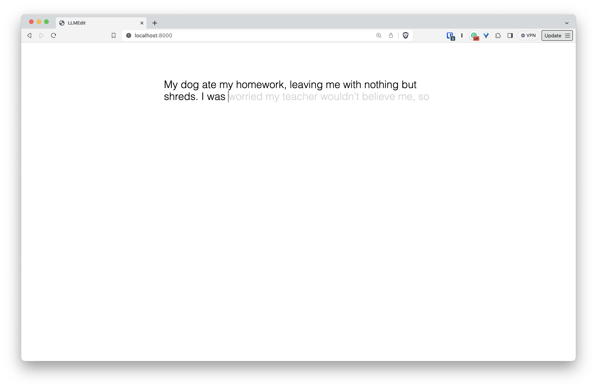

# Alscribe


Minimal, hackable, GPT powered text editor. Really really really barebones. Tab to complete. 

### 1. Add your api key to `api_key.txt`
Not very safe, but good enough for running locally.
### 2. Run in the root dir (python3)
```
python -m http.server
```


